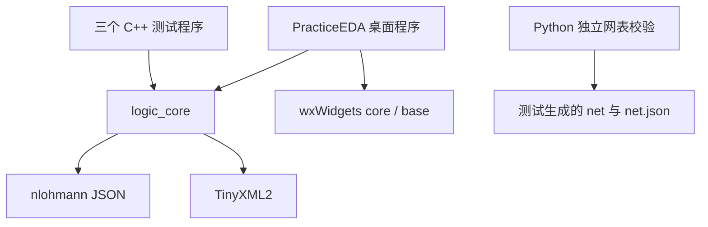
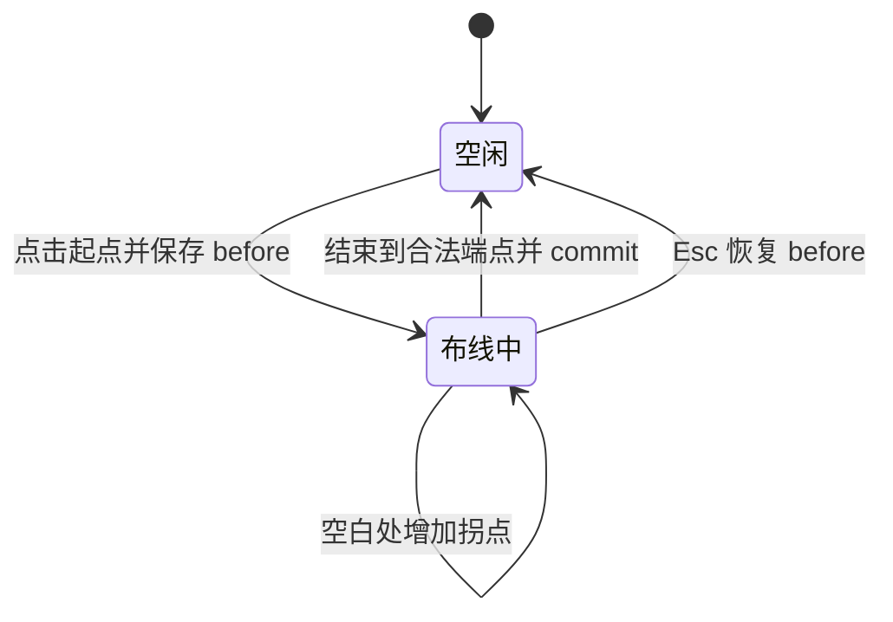
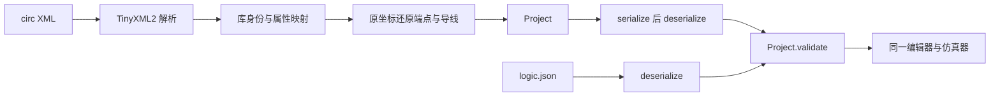

# PracticeEDA 源码详细讲解

> 面向四人小组答辩与代码走读。依据当前工作区源码编写，核对日期为 2026-09-22。本文解释现有实现；优化建议均单独标明。源码链接按本文件在仓库 `docs/defense/` 中的位置组织。

## 阅读顺序与项目定位

PracticeEDA 是 C++17 / wxWidgets 桌面数字电路编辑器。它将用户画出的电路转换为显式连接网络，再通过事件驱动仿真计算结果，支持工程保存、子电路复用、网表导出和 Logisim 2.7 的受限导入。当前目标是数字逻辑教学与交互验证，不承担模拟电路求解、PCB 布线制造或完整 HDL 仿真。

第一次读代码，建议依次读 `Digital.h` 理解数据、`halfAdder()` 理解数据如何组合、`ports()` 理解接口、`Simulator::Impl` 理解运行过程，最后读编辑器和导入器。不要从两千多行的窗口构造与 GUI 检查直接开始。

| 阅读入口 | 解决的问题 | 答辩主负责人 |
| --- | --- | --- |
| [CMakeLists.txt](../../CMakeLists.txt)、[App.cpp](../../src/App.cpp) | 如何构建、启动、加载工程 | A |
| [Digital.h](../../include/Digital.h)、[LogicSupport.h](../../include/LogicSupport.h) | 工程、元件、连接、信号的表示 | A |
| [DigitalEditor.cpp](../../src/DigitalEditor.cpp) | 用户操作如何变成可靠的模型修改 | B |
| [LogicSupport.cpp](../../src/LogicSupport.cpp)、[LogicSymbols.cpp](../../src/LogicSymbols.cpp) | 坐标、文件和绘图基础 | B |
| [Digital.cpp](../../src/Digital.cpp) | 网络编译、仿真、持久化、历史、分析 | C 主讲仿真，A/B 配合模型与历史 |
| [CustomComponents.cpp](../../src/CustomComponents.cpp) | 元件定义跨工程复用 | D |
| [LogisimImport.cpp](../../src/LogisimImport.cpp) | 外部格式转换和可诊断降级 | D |
| [tests](../../tests) | 如何用自动化验证行为 | D 统筹，各模块负责对应测试 |

## 1. 构建结构：核心逻辑为什么能脱离窗口运行

`CMakeLists.txt` 将 `LogicSupport.cpp`、`Digital.cpp`、`CustomComponents.cpp`、`LogisimImport.cpp` 和 TinyXML2 编译为 `logic_core`。核心库不依赖 wxWidgets。打开 `EDA_BUILD_GUI` 才查找 wxWidgets，并构建 `PracticeEDA` 可执行文件。测试程序直接链接 `logic_core`，因此不需要显示器和鼠标，也能检验仿真与文件行为。



`BUILD_TESTING` 控制测试目标；Python 解释器可用时额外注册 `netlist_format_tests`。因而当前环境是 **4 个 CTest 测试目标**，不是所有环境必然都有 4 个。CMake 的 `install()` 将程序、示例、说明和许可文件放入分发目录。

`scripts/build.ps1` 串起配置、构建、CTest、可选 GUI 检查及可选安装。任何一步非零退出都会阻止后续成功报告。Debug 和 Release 是不同配置；最新 `.circ` 功能已验证 Debug，不要把旧报告的 Release 结果自动延伸到最新工作区。

**方案比较**：把求值代码直接写进鼠标回调，初期文件更少，但每次验证都要启动界面。当前核心库拆分增加了 API 边界，却换来了独立测试、组合电路分析、文件转换共用同一套语义的能力。

## 2. 启动链：从 main 到用户看到的电路

`wxIMPLEMENT_APP(PracticeApp)` 生成 wxWidgets 平台入口。`OnInitCmdLine()` 注册可选工程路径、兼容参数 `--logic` 和 `--smoke-test`。`OnInit()` 完成以下工作：初始化 wxWidgets、注册 PNG 处理器、创建 `LogicEditor`、显示窗口；若给了路径，调用 `load()`；若要求 GUI 检查，利用 `CallAfter()` 等事件循环建立后执行。

`PracticeApp::OnRun()` 将 GUI 检查失败转成进程退出码 1，避免“弹过错误但命令返回成功”。正常启动与测试启动共用同一个窗口类，不另写一套假界面。

```text
操作系统启动
  → wxIMPLEMENT_APP
  → PracticeApp::OnInit
  → LogicEditor 构造
  → 建菜单、工具栏、分类树、属性面板、画布、诊断列表
  → 绑定事件
  → rebuild() 建立仿真器与视图
  → 可选 load(path)
  → wxWidgets 事件循环
```

## 3. 领域模型：几何、连接和运行状态分别保存

### 3.1 Project / Circuit / Part

源码：[include/Digital.h](../../include/Digital.h)，第 13—20 行。

```cpp
struct Part {
    // circuit is used only by Subcircuit; value/data are reset values, never live simulation state.
    std::string id, kind = "And", label, circuit;
    Point at;
    int width = 1;
    uint32_t value = 0;
    std::vector<uint32_t> data;
};
```

`Part` 是可持久化的元件实例描述。`kind` 使用稳定英文标识，如 `And`、`Register`；中文名称从 `library()` 查询。`label` 是用户可修改的显示名。`circuit` 仅在 `Subcircuit` 元件中引用定义名称。`at` 是模型坐标。`value` 和 `data` 是复位初值，**不是当前寄存器/RAM 的运行快照**。

`Circuit` 拥有元件 `parts`、显式节点 `nodes` 和导线 `wires`。`Project` 拥有多个电路定义、主电路名 `main`、工程名以及 ID 分配器 `nextId`。`Project::id(prefix)` 递增生成对象 ID，`validate()` 检查整个工程内唯一性和 `nextId` 的有效性。

### 3.2 Endpoint / Junction / Wire

源码：[include/LogicSupport.h](../../include/LogicSupport.h)，第 30—35 行。

```cpp
struct Endpoint {
    // An empty pin names a junction; a nonempty pin is the stable port ID on a part.
    std::string object, pin;
    std::string key() const { return object + ":" + pin; }
    bool operator==(const Endpoint &b) const { return object == b.object && pin == b.pin; }
};
```

`Endpoint{"p12","Y"}` 表示元件 p12 的 Y 引脚；`Endpoint{"j8",""}` 表示节点 j8。`Wire` 的 a/b 是两个电气端点，`bends` 只存视觉拐点。移动元件只需改变 `Part.at`；画图时重新查询端点位置，连接本身不会丢失。

例如 `A.Y → XOR.A` 保存的不是 `(210,140) → (360,180)`，而是两个稳定 ID。坐标改变、标签改名都不影响网络。反过来，两条线视觉交叉不自动表示电气连接。

### 3.3 ports() 是引脚信息的统一来源

`ports(project, part)` 按元件类型生成引脚 ID、输入/输出方向、位宽和相对坐标。例如 Mux 为 A/B/S/Y，S 恒为 1 位；RAM 的 ADDR 恒为 8 位；Clock 强制单比特。普通绘制、连接命中、网络编译和网表导出都复用这些信息。

子电路端口更特殊：定义内部 Input/Output 的对象 ID 就是外部实例的端口 ID。因此将输入标签 DATA 改为 BUS 不会断线。导入定义时，必须同时重映射“实例对象 ID”和“定义接口 ID”。

### 3.4 结构与状态的边界

| 数据 | 保存位置 | 何时变化 | 是否写入工程 |
| --- | --- | --- | --- |
| 元件类型、位置、位宽、初值 | Project / Part | 编辑与属性操作 | 是 |
| 当前网络值、事件队列 | Simulator::Impl | 仿真推进 | 否 |
| 寄存器状态、RAM 运行值 | 展平后的 Node | 复位或时钟采样 | 否 |
| 缩放、平移、选区、临时折线 | LogicCanvas | 鼠标键盘操作 | 否 |
| 未支持导入元件的说明 | 普通 Text Part | 导入后可编辑 | 是 |

这种分离减少了保存格式对内部仿真实现的依赖，但也意味着没有运行断点恢复功能。

## 4. 保存和校验：原生格式为什么一直是 version 1

`serialize()` 构造 `format="PracticeEDA.logic"`、`version=1` 的 JSON，将全部电路定义、元件初值、节点和连线完整写出。`deserialize()` 先检查文件大小与格式，再读取字段，最后调用 `Project::validate()`。新功能没有另建一套工程模型。

`validate()` 检查的范围包括：

1. 主电路存在，电路名称非空且不重复，电路数在 1–128 之间。
2. 对象 ID 唯一且合法，`nextId` 高于已有 ID 数值部分。
3. 坐标是有限数值且在范围内，位宽为 1–32，时钟位宽为 1。
4. 元件类型可识别，子电路引用存在，输入输出名称不重复。
5. 所有导线端点能通过 `endpoint()` 解析，存储器最多 256 字。
6. 每电路最多 10,000 元件、40,000 节点和 40,000 导线。
7. DFS 用访问栈拒绝递归引用，并限制嵌套深度。

**需要区分两类问题**：无效端点、坏格式属于结构错误，拒绝载入；有效端点之间的位宽冲突、悬空或驱动冲突属于可编辑的电路问题，由网络编译和仿真诊断呈现。`validate()` 通过不等于电路功能正确。

`writeAtomic()` 在同目录生成临时文件，写入、flush、close 均检查成功后，Windows 使用 `MoveFileExW` 替换目标，其他平台使用文件系统 rename。失败时清理临时文件并抛异常。它保护已有文件免于普通写入失败造成的半文件覆盖，但不能宣称防御所有断电和硬件故障。

## 5. 编辑器：一次操作如何成为一个可撤销事务

`LogicEditor` 拥有 History、当前电路名、保存路径、Simulator 和各个 GUI 控件。`LogicCanvas` 管理视口和临时手势。结构性菜单操作多数进入 `change(action)`：

源码：[src/DigitalEditor.cpp](../../src/DigitalEditor.cpp)，第 704—720 行。

```cpp
void LogicEditor::change(const std::function<void()> &action) {
    // A failed edit must restore both the full model and the currently open definition.
    canvas->cancel();
    auto before = history.project;
    auto oldCurrent = current;
    try {
        action();
        history.project.validate();
        history.commit(before);
        rebuild(true, true);
    } catch (...) {
        history.project = std::move(before);
        current = oldCurrent;
        rebuild(true, true);
        throw;
    }
}
```

执行顺序是：取消临时手势、保存工程与当前电路名、执行业务修改、校验、提交历史、重建。如果抛异常，则恢复工程与当前电路，再重建并继续抛给错误提示层。这里的“事务”是内存快照与异常回滚，不是数据库事务。

`History` 保存完整工程快照，最多保留 100 步。`commit()` 对比序列化结果，忽略无实际变化的操作；发生新编辑时清空 redo 栈。`dirty()` 比较当前序列化结果与上次保存结果，而非用一个可能漏置位的布尔标志。

**取舍**：命令模式可只保存移动向量、添加对象等增量，更省内存，但复杂操作需维护精确逆操作，尤其跨定义导入更难。当前教学规模采用全工程快照，便于可靠回滚和跨子电路撤销；代价是复制内存与序列化比较的成本。更大的工程可以考虑命令/增量日志，这是后续优化，不是当前实现。

## 6. 坐标变换、命中与布线

### 6.1 模型坐标和屏幕坐标

`screen = world × zoom + offset`，反变换为 `world = (screen - offset) / zoom`。模型不跟随分辨率或窗口大小变化。`zoomAt()` 先保存鼠标对应的世界点，再调整 offset，保证缩放前后鼠标仍指向同一元件位置：

源码：[src/LogicSupport.cpp](../../src/LogicSupport.cpp)，第 24—29 行。

```cpp
void View::zoomAt(Point p, double z) {
    // Keep the world point under the cursor fixed while changing scale.
    auto w = world(p);
    zoom = std::clamp(z, 0.1, 80.0);
    offset = p - w * zoom;
}
```

引脚命中使用距离阈值除以 zoom，因此屏幕上可点击范围基本稳定。`snap()` 以网格间距四舍五入，布线和放置得到整齐位置。`segmentDistance()` 用投影参数 t 并裁剪到 `[0,1]`，求鼠标到线段的最近距离。

### 6.2 布线状态机

第一次点击端点时，`route()` 保存 `before` 工程快照并设定 `start`。空白处点击只增加 `bends`。点中另一引脚、已有导线或明确要求自由端点时，建立 Wire、校验、提交历史和重建。



点到已有导线中段时，`endpointAt()` 求线上投影位置、新建 Junction，并把原 Wire 分成两条：原 a 到新节点，新节点到原 b。原来的视觉拐点也按位置拆分。它返回新节点作为当前布线端点，而不是只在图上画一个圆点。

**重要细节**：第一次点在线上就可能已经修改节点/导线，所以取消时必须恢复整个 before 快照，不能仅清空起点与临时折线。GUI 测试明确覆盖分支取消和分支撤销。

### 6.3 拖动、输入与绘图

拖动期间更新模型位置，鼠标松开后将整个拖动提交为一次历史操作。Input/Button 的值变化可以调用 `Simulator::setInput()` 保留运行状态；结构和一般属性变化则重建仿真器，复位时序状态。两者不能混成同一条更新路径。

`LogicSymbols.cpp` 中的 `eda::logic::drawSymbol()` 负责矢量电路符号，普通画布、放置预览和 PNG 导出共用。`LogicIcons` 则服务工具栏和分类树，小图标不是电气引脚的定义。`exportPng()` 计算完整内容范围后调用渲染的 clean 模式，去掉选择框、网格和引脚涟漪。

## 7. 网络编译：为什么要展平和并查集

Simulator 的构造先校验工程，再将指定根电路展平。一个基本元件实例成为一个 `Node`；电气网络成为一个 `NetState`。Node 保存元件副本、实例路径、引脚到网络的映射、输出、当前状态、上一时刻时钟和内存。

`key()` 为 `实例路径:引脚` 分配编号，`unite()` 合并显式 Wire 的两端，同一实例内的同名节点也合并。`find()` 使用路径压缩。最后将并查集代表元重编号为网络数组下标，建立每个网络的 drivers 和 users。

源码：[src/Digital.cpp](../../src/Digital.cpp)，第 708—714 行。

```cpp
int find(int i) { return parent[i] == i ? i : parent[i] = find(parent[i]); }
void unite(int a, int b) {
    a = find(a);
    b = find(b);
    if (a != b)
        parent[b] = a;
}
```

不要在答辩中把复杂度直接说成严格 `O(n)`，也不要声称代码有按秩合并：这里有路径压缩，但没有显式 union-by-rank；同时 `std::map` 查询本身还有对数成本。准确说法是“避免每次求值重新遍历全部线段，编译后以网络编号查询，并通过路径压缩降低重复查找成本”。

### 子电路实例隔离

假设两个实例 p10、p20 引用同一个寄存器定义，其中内部寄存器 ID 都为 p3。展平后分别形成 `p10/p3` 与 `p20/p3`，它们是不同 Node，各自拥有 state 和 memory。内部同名节点也只在各自 flatten 调用的局部 labels 表中合并。

子电路接口不再作为独立驱动源运行：内部 Input/Output 端点被合并到外部实例端口，而不是再往网络上增加一份输入初值。这避免共享定义造成错误短接或多驱动。

**方案比较**：保留层次结构并递归跨层传值，编辑模型直观，但每步求值需要处理跨层传播。展平会增加编译期内存，却简化运行时事件队列、实例状态隔离和网表生成；当前选择后者。

## 8. 信号表示：bool 为什么不够

源码：[include/Digital.h](../../include/Digital.h)，第 85—97 行。

```cpp
struct Signal {
    // Per-bit masks distinguish known 0/1, high impedance (z), unknown and conflicting drivers (error).
    int width = 1;
    uint32_t value = 0, known = 0, z = 0, error = 0;
    static Signal number(uint32_t value, int width);
    static Signal unknown(int width);
    static Signal floating(int width);
    static Signal failure(int width);
    bool defined() const;
    std::string text() const;
    bool operator==(const Signal &) const;
    bool operator!=(const Signal &s) const { return !(*this == s); }
};
```

Signal 用位宽和四个 32 位掩码表示总线：`value` 保存位值，`known` 指示确定的 0/1，`z` 指示高阻，`error` 指示冲突或非法值；没有落在这些有效标记中的位代表 X。项目通常称其为四态机制，并额外显式区分错误 E；不要声称它与某一种 HDL 的状态系统完全一致。

| 1 位信号 | value | known | z | error |
| --- | ---: | ---: | ---: | ---: |
| 0 | 0 | 1 | 0 | 0 |
| 1 | 1 | 1 | 0 | 0 |
| X | 0 | 0 | 0 | 0 |
| Z | 0 | 0 | 1 | 0 |
| E | 0 | 0 | 0 | 1 |

`Signal::number()` 使用位宽掩码截断数值，32 位需要特殊处理，避免执行非法的 `1 << 32`。`defined()` 检查所有位都已知且没有错误。显示函数可输出二进制状态文本，画布进一步映射为不同颜色。

`resolve()` 对每个网络的每一位收集所有驱动：没有主动驱动为 Z；已知 0 与已知 1 同时驱动为 E；存在未知驱动且没有确定可解的结果时保留 X。三态元件关闭时输出 Z，不等同于输出 0。

逻辑门并不要求“任意输入 X 就整个结果 X”。AND 任一已知 0 可决定该位结果 0；OR 任一已知 1 可决定结果 1；XOR 需要两输入都确定。实现利用 known/value 掩码按位推导，保留总线中仍可确定的位。

## 9. 事件驱动：本项目最值得讲清的算法

事件队列实际类型为 `std::map<uint64_t, std::set<size_t>>`。外层 key 是逻辑时刻，begin() 取最早批次；内层 set 是需要求值的 Node 下标，可对同一时刻的重复调度去重。这里没有工作线程池，也没有用墙上时间模拟每个器件的物理延迟。

一次 `step()` 分两阶段：

1. 拿出最早时刻的整个 batch，让其中每个 Node 从**旧网络信号**读取输入，更新自己的输出缓存，记录受影响网络。
2. 所有 Node 求值完毕后，逐个 resolve 受影响网络。只有网络信号真的变化，才将 users 加入 `queue[now+1]`。

源码：[src/Digital.cpp](../../src/Digital.cpp)，第 1063—1095 行。

```cpp
bool step() {
    // Evaluate the entire time batch against old net values, then publish all changed nets.
    // Updating nets inside the first loop would make clock sampling depend on component order.
    if (queue.empty() || oscillating)
        return false;
    auto it = queue.begin();
    now = it->first;
    auto batch = it->second;
    queue.erase(it);
    std::set<int> affected;
    for (auto i : batch) {
        auto &n = nodes[i];
        auto before = n.outputs;
        evaluate(n);
        for (auto &out : n.outputs)
            if (before[out.first] != out.second) {
                affected.insert(n.nets[out.first]);
                traces.push_back({now, n.path, out.first, out.second.text()});
            }
    }
    if (traces.size() > 2000)
        traces.erase(traces.begin(), traces.begin() + ptrdiff_t(traces.size() - 2000));
    for (auto i : affected) {
        auto &net = nets[i];
        auto s = resolve(net);
        if (s != net.signal) {
            net.signal = s;
            for (auto user : net.users)
                queue[now + 1].insert(user);
        }
    }
    return true;
}
```

代码中每个 Node 的 outputs 会先改变，但网络的 signal 尚未发布，而 `input()` 只读 net.signal。因此同批次的元件看见同一份旧网络值，不会因为 vector 排列顺序而提前看到另一个元件的新输出。

### 两级寄存器示例

R1.Q 连接 R2.D，二者共享同一时钟。上升沿前 R1=1、R2=0，R1.D=0。理想的同步采样结果是 R1=0、R2=1。如果先求 R1 就立即把网络改成 0，再求 R2，R2 可能错误读到新值 0。当前批处理使二者先采样旧网络，避免这类遍历顺序依赖。

### 不同方案的边界

| 方案 | 优点 | 代价 | 当前用途 |
| --- | --- | --- | --- |
| 固定周期扫描所有元件 | 实现直观 | 无变化也重复求值；顺序问题需额外处理 | 设计备选，非当前实现 |
| 组合电路拓扑排序 | 无环组合网可一次传播 | 时序反馈、组合环不能统一套用 | 可用于未来优化 |
| 按逻辑时刻调度变化 | 下游按需更新，适合时序 | 需处理队列、冲突和不收敛 | 当前实现 |

`settle()` 默认最多推进 10,000 个事件时间批次，超限标记振荡或传播过长，并给出诊断。这个上限是防止界面卡死的保护，不是证明存在振荡的形式化算法。Trace 保留最近 2,000 条输出变化。`tick()` 翻转每个时钟一次并 settle，表示半周期；F8 不等于“执行一条指令”。

## 10. 时序元件与存储器

`previousClock` 和当前 CLK 都必须 defined，且发生明确 0→1 才算上升沿。X/Z→1 不当成可靠边沿。Register/DFF 在边沿读取 D；Counter 在 EN 为真时递增；ShiftRegister 左移后从最低位移入 D；T/JK/SR 根据输入和旧 state 按位更新。

RAM/ROM 固定 8 位地址，256 字。RAM 上升沿在 WE=1 时写入，Q 根据当前地址异步读取；ROM 仅查表。未知写地址或写使能会按代码传播未知状态，不能假装是“不写入”。复位重新加载 Part.value / Part.data。

**功能边界**：统一传播延迟为逻辑时间 1；没有器件建立保持时间、亚稳态、电压电流或真实纳秒参数。这是离散逻辑仿真。答辩展示寄存器行为时，应说明能验证逻辑采样顺序，不能据此完成真实芯片时序签核。

## 11. 真值表、表达式和诊断

`truthTable()` 先递归检查是否存在时序元件，再统计输入总位数和输出总位数。输入最多 10 位，对应最多 `2^10=1024` 行；输出至少 1 位且最多 128 位。每一行复位独立分析用 Simulator，设置输入，等待收敛，然后读取输出。它不使用编辑器正在运行的 Simulator，因此分析不应改变用户的寄存器和队列。

若含时序元件、不收敛或输出含 X/Z/E，函数明确拒绝生成确定真值表。`Table::report()` 给出标准与或式，没有实现卡诺图或 Quine–McCluskey 最小化。`expressionTable()` 是按非、与、异或、或优先级组织的递归解析，支持括号、变量和常量，不依赖脚本 eval。

诊断由两路组成：`Simulator::issues()` 报告网络与运行问题；`logisimDiagnostics()` 扫描 Text 元件恢复导入提示。`LogicEditor::rebuild()` 将两路合并到 issues，再同步列表。列表条目带 object ID，双击时查找元件/节点/导线，选中并将视口移到对象位置。

## 12. 自定义元件：依赖闭包和 ID 重映射

`createComponent()` 在 candidate 工程上创建输入输出接口，校验名称、数量和位宽后才替换原工程。它只创建接口，不自动合成用户想要的内部电路。

`exportComponent()` 从指定根电路 DFS，收集所有可达子电路定义，剔除无关电路，然后将原生 Project 放入 `PracticeEDA.component` version 1 外壳。文件具有自己的依赖闭包，跨工程复用不依赖源工程仍然存在。

`importComponent()` 的关键步骤是先原生反序列化并校验，再建立两个映射表：旧电路名→新电路名、旧对象 ID→新 ID。同名定义加 `_import1` 等后缀，避免覆盖目标工程。然后改写所有元件、节点、导线 ID，以及导线端点。

源码：[src/CustomComponents.cpp](../../src/CustomComponents.cpp)，第 96—101 行。

```cpp
auto remapEndpoint = [&](Endpoint &e) {
    const auto *part = source.circuit(c.name).part(e.object);
    if (part && part->kind == "Subcircuit")
        e.pin = ids.at(e.pin);
    e.object = ids.at(e.object);
};
```

如果端点的 object 原本指向 Subcircuit，端点的 pin 也是某个内部接口对象的 ID，需要用同一 ids 表改写。这是容易遗漏的第二层重映射。最后 `candidate.validate()` 成功才赋值回 project，形成原子导入。

## 13. 网表导出：为什么复用仿真网络

`Simulator::netlist()` 从编译后的 nodes/nets/roots 导出，不推进 step、不翻转 tick，也不读取运行信号来决定接线。JSON 形式保留实例路径、初值、位宽、引脚和网络别名。KiCad S-expression 将每条总线按位展开，例如 8 位 Y 变成 Y[0]…Y[7]。

这样，仿真与导出对于“哪些端点相连”的判断只有一个来源，减少另写几何识别算法造成的不一致。位宽冲突会拒绝网表导出；悬空网络仍会保留。

**不要夸大兼容性**：该网表表达逻辑连接，没有真实芯片引脚号和 PCB 封装，不等于可生产文件。已经执行独立语法/连接比对，但没有完成外部 KiCad PCB 导入验收。

## 14. Logisim 受限导入：独立边界适配层

### 14.1 两种格式共用一个内部模型



导入器只承担边界转换。`.circ` 不是新的保存主格式，当前序列化器无需增加 rotation 或 foreignComponent 字段。成功映射的对象使用已有 Part；无法映射的对象使用已有 Text。

### 14.2 XML 和库身份

`importLogisim()` 拒绝超过 32 MB 的输入、NUL、DTD 和实体声明，再由 TinyXML2 检查 XML。它要求 source 属于 2.7、project version 为 1.0，并要求唯一 main。

`<lib name="42" desc="#Gates">` 中的编号可以改变，所以不能把 `lib="1"` 永远当作 Gates。导入器先建立 name→desc，再结合元件 name 决定映射。同名外部库不冒充内置元件；不加载 JAR 或外部文件。

### 14.3 mapPart() 的保守规则

Wiring 支持基本输入输出、常量、电源、地、标准时钟、Probe、Tunnel 和特定零扩展器。Gates 支持双输入门、NOT、Buffer 和 Controlled Buffer。Plexers 支持 2:1 Mux、1:2 Demux、2:4 Decoder。Memory 支持受限触发器、寄存器、ROM、分离读写 RAM。完整属性限制见 [导入说明](../LOGISIM_IMPORT_CN.md)。

例如 Logisim 常规门默认 5 输入，当前模型固定 2 输入，不能只因为名称是 AND 就直接导入。Splitter 在 Logisim 中可双向传输，也不能机械替换成单向 Splitter。已接线的清零、预置、额外使能或反相输出无法等价表示时，整个元件保留占位。

**一般错误与致命错误分开**：局部映射异常被捕获为 reason；坏 XML、非法坐标、重复电路名、主电路不存在或转换后规模超限则拒绝整个加载。拒绝发生在替换编辑器工程之前。

### 14.4 原坐标怎样变成显式连接

读取每条水平/垂直线段端点，加上可识别的元件引脚坐标，建立坐标→Junction ID 表。按 y 建水平索引、按 x 建垂直索引，在每条源线段范围内查找已存在的节点，并连接相邻节点。

这套方法能处理 T 形接点、重叠线、端点接触和线中间引脚；没有端点或引脚的纯交叉处不会凭空创建节点。方向转换使用核对过的 Logisim 引脚位置，不能假定所有器件引脚编号只是整体旋转。

模型采用标准朝向并放大源坐标，新增端口引线连接到原坐标节点，因而电气连通优先于像素级外观。Probe 位宽依据连通分量中的端口推断，而不是找视觉上最近的元件。

### 14.5 诊断为什么能保存和撤销

源码：[src/LogisimImport.cpp](../../src/LogisimImport.cpp)，第 289—296 行。

```cpp
void note(Project &p, Circuit &c, Point at, const std::string &message) {
    Part q;
    q.id = p.id("p");
    q.kind = "Text";
    q.at = at;
    q.label = notePrefix + message;
    c.parts.push_back(std::move(q));
}
```

无法映射时，label 包含“Logisim 导入：”前缀、元件名、库、原坐标、原属性和原因。`logisimDiagnostics()` 每次从当前电路的 Text 中重新提取提示，所以仿真重建不会冲掉它，原生保存/加载和撤销也自然支持。

这是受限导入的务实方案，不是无损 round-trip：文字占位不具备原器件电气行为，也不能导回原始 `.circ`。用户修复后可以删除提示文字。长期若要实现真正的外部格式往返，适合另行设计版本化的原始元数据结构。

最后一行是关键设计选择：

源码：[src/LogisimImport.cpp](../../src/LogisimImport.cpp)，第 511—511 行。

```cpp
return deserialize(serialize(p));
```

这种写法重复了一次 JSON 编解码，带来时间和内存成本，但能够确保转换结果使用与原生导入完全相同的合法性契约。避免为 `.circ` 维护第二套逐渐偏离的验证规则。

### 14.6 编辑器载入与源文件保护

`load()` 按扩展名决定 `importLogisim()` 或 `deserialize()`，得到完整候选工程后再询问是否丢弃旧编辑。`.circ` 导入使用 `history.reset(loaded, false)`，保持 dirty，并清空 savedPath。保存仍调用原生 serialize；如果手动指定 `.circ` 后缀，会追加 `.logic.json`。当前源文件不会被默认保存覆盖。

## 15. 自动化验证：每层测试到底证明什么

| 验证层 | 当前核对结果 | 代表性断言 | 不应推导的结论 |
| --- | --- | --- | --- |
| digital_logic_tests | 173 项检查 | 门、总线、边沿、状态、层次和文件拒绝 | 覆盖全部可能电路 |
| component_netlist_tests | 135 项检查 | 依赖、重名、双层 ID、失败回滚、只读导出 | 外部 EDA 工具全兼容 |
| logisim_import_tests | 1,067 项检查 | 门朝向/尺寸、复用器、内存、拓扑、占位与往返 | 支持 1,067 种器件 |
| netlist_format_tests | 49 组输出对比 | Python 独立解析 S-expression 并逐位核对 JSON | 已通过 KiCad PCB 验收 |
| GUI runSmoke | 成功标志和图像 | 实际窗口、编辑事件、保存重开、诊断定位 | 全部人工交互都已自动化 |

前三个 C++ 程序报告的检查项合计 1,375；这不是代码覆盖率，也不应和 49 组文件对比混成“1,424 个单元测试”。CTest 目标数、运行时断言数、文件对比组数是三种不同统计口径。

`verify_netlists.py` 用独立 tokenizer 和栈解析括号表达式，检查转义字符串、元件字段、网络唯一性和每个标量 pin 所属网络。这比只检查文件中是否出现 `(net` 更有价值，因为它对导出语义做双向比对。

GUI 检查走真实 `load()`/`save()` 路径，确认 `.circ` 导入未保存状态、diagnostics 重建、双击定位、原文件字节未改变、原生重开后的诊断持久性；但原生文件选择器的人工点击没有自动化。示例图来自真实程序导出，不是设计稿。

## 16. 完整案例：半加器输入变化到屏幕输出

1. 用户切换 Input A，编辑器更新 Part.value 并将旧 Project 提交 History。
2. `setInput(A,1)` 修改对应源 Node.state，并调度源节点。
3. 源节点求值得到 Y=1，网络 resolve 后变化，下游 XOR/AND 进入后一时刻。
4. XOR/AND 读取同批次之前的输入网络，生成各自输出。
5. 输出网络发布后，Output 元件读取 A 引脚所属网络；画布按 Signal 值绘制颜色和数字。
6. 保存写的是当前工程结构和输入初值；仿真时刻、事件轨迹不写入。

这条调用链将“用户看到的现象”连到“源码里的职责”，适合答辩时指着实际半加器演示。另一个推荐案例是 `logisim-limited.circ`：A/B 经过 XOR/AND、MUX 选择、寄存器采样，同时观察未支持 Adder 的占位。

## 17. 已知边界与可实施的下一轮迭代

- **大工程成本**：全量快照、重建编译及 JSON 校验往返都有开销。先做真实规模基准，再选择增量历史或增量编译，不能无依据声称已提升若干倍。
- **核心文件集中**：`Digital.cpp` 同时承担模型、持久化、编译、求值和分析。可按稳定 API 拆分文件，保持测试和格式兼容。
- **模型表达力**：`.circ` 受限支持缺少双向分线、复杂控制端等。优先为一种新器件补端口/语义/测试，再开放导入映射，避免先“能读”后发现仿真不等价。
- **持久化**：没有自动恢复和运行状态快照。若实现，应明确区分工程初值与仿真断点，并设计版本迁移。
- **仿真**：统一逻辑延迟和预算保护适合教学。真实时序建模或 HDL 联动需要新需求与验证体系。
- **性能与可维护性**：当前检查证明功能回归通过，不是性能压测。不得把标准库容器的理论优势写成测得的 FPS 或加速比。

## 18. 答辩中应避免的错误表述

| 容易误说 | 准确说法 |
| --- | --- |
| “我们实现了完整 Logisim” | 数字编辑器，提供 Logisim 2.7 受限导入 |
| “用多线程并行仿真” | 单线程离散事件批处理，语义上的同时求值 |
| “画到一起就连接” | 原生模型使用显式端点，导入时才按源文件规则还原连接 |
| “存档保留运行中的 RAM” | 存档保存初值，复位后重新装载 |
| “并查集严格 O(1)” | 使用路径压缩降低重复查找成本，还包含 map 成本 |
| “1,067 个测试用例” | 新增导入测试程序执行 1,067 项检查 |
| “所有备选方案都做过” | 只有有源码或记录证据的方案称为实现；其他是设计复盘 |
| “A/B/C/D 当时各写了什么” | 这是建议答辩分工，真实贡献由小组核对后填写 |

建议每位成员至少能解释本模块的输入、输出、不变量、异常路径和一个失败案例。源码讲解的重点是理解机制与取舍，不是逐行念代码。
